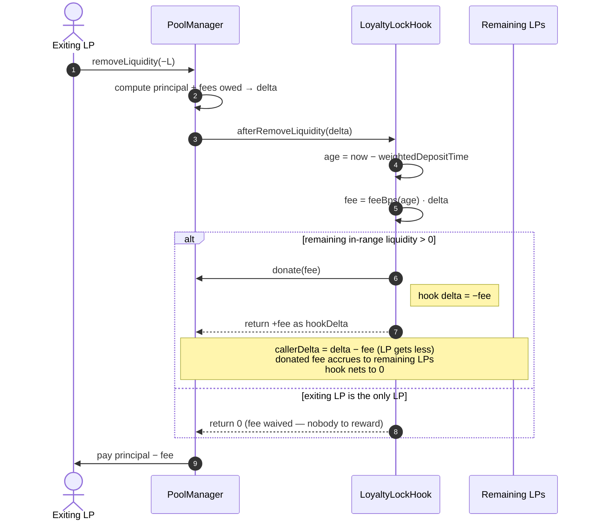
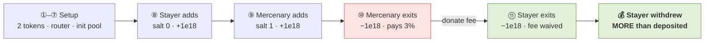
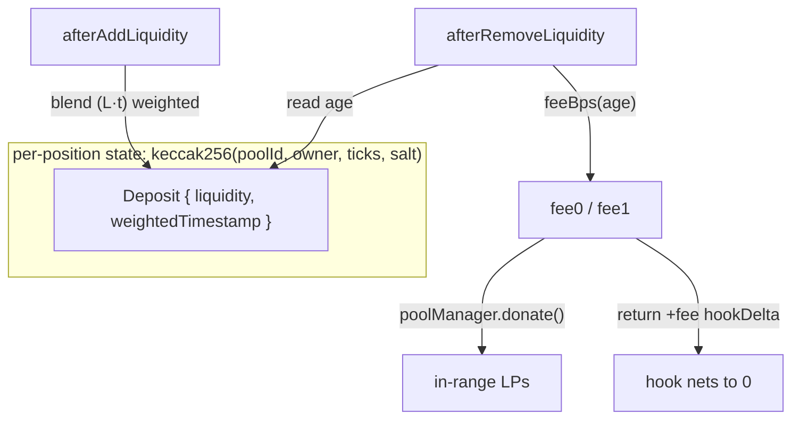

# 🔒 Loyalty Lock — a Uniswap v4 Hook

**A time-decaying exit fee that turns mercenary churn into yield for loyal LPs.**
---

## The problem

Liquidity pools bleed value to **mercenary liquidity**: capital that farms incentives, then exits
the moment a better yield appears. It inflates TVL on paper but leaves real LPs with thin depth,
wider spreads, and the "cold‑start" problem on every new pool.

Across the 556‑project UHI Hook Directory, *every* anti‑mercenary design uses a **carrot** —
streaming rewards, epoch incentives, loyalty tiers. The dual is unoccupied:

| Searched the 556‑project directory for | Hits |
|---|---|
| `"exit fee"` | **0** |
| `"early withdraw"` | **0** |
| `"withdrawal fee"` | 1 *(unrelated Harberger auction)* |
| `"mercenary"` | 4 — **all reward‑based, none penalty‑based** |

## The solution

A **stick**, paid to the people who stay. When an LP withdraws, Loyalty Lock charges an exit fee
that **decays linearly from `maxFeeBps` → 0** over `vestDuration`, and **donates that fee to the
LPs still in range**. Quick flippers subsidise long‑term liquidity; LPs who vest fully leave free.

```
feeBps(age) = maxFeeBps · (vestDuration − min(age, vestDuration)) / vestDuration
```

| Holding time | Exit fee (with `maxFeeBps = 300`, `vestDuration = 30d`) |
|---|---|
| 0 (instant) | **3.00 %** |
| 7 days | 2.30 % |
| 15 days | 1.50 % |
| ≥ 30 days | **0 %** |

---

## How it works

Two callbacks. `afterAddLiquidity` stamps a **liquidity‑weighted** deposit time per position;
`afterRemoveLiquidity` prices the decayed fee, **donates it to the remaining LPs**, and reclaims
it as a hook delta so the hook nets to zero and the exiting LP simply receives that much less.



**Why it nets to zero:** the PoolManager applies `callerDelta = delta − hookDelta` and credits
`hookDelta` to the hook. The hook's `donate()` gives it a `−fee` delta; returning `+fee` cancels
it. No tokens are ever custodied by the hook. The exiting LP's liquidity is already out of range
when the donation happens, so only the **stayers** receive it.

**Sole‑LP guard:** if `getLiquidity(poolId) == 0` after the removal there is nobody to reward, so
the fee is waived — a lone LP can always exit.

---

## ✅ Live on Ethereum Sepolia

| Contract | Address |
|---|---|
| **LoyaltyLockHook** | [`0x22ee81a8adEb1B64D19E00c812185C89371A0501`](https://sepolia.etherscan.io/address/0x22ee81a8adEb1B64D19E00c812185C89371A0501) — low bits `0x501` = `AFTER_ADD ∣ AFTER_REMOVE ∣ AFTER_REMOVE_RETURNS_DELTA` |
| PoolManager (canonical v4) | [`0xE03A1074c86CFeDd5C142C4F04F1a1536e203543`](https://sepolia.etherscan.io/address/0xE03A1074c86CFeDd5C142C4F04F1a1536e203543) |
| Deploy tx | [`0xe45cd44e…3905c7`](https://sepolia.etherscan.io/tx/0xe45cd44ea3b6bea600dcbaeb1946406be5223fc72610a3ae27b4225d193905c7) |
| Params | `maxFeeBps = 300` (3 %) · `vestDuration = 2592000` (30 days) |

Direct on‑chain reads: `quoteFeeBps` = **300 / 230 / 150 / 0** at age 0 / 7d / 15d / 30d ·
`getHookPermissions()` returns exactly the three flags above.

---

## 🔬 Full lifecycle — proven on‑chain with real transactions

`script/OnchainDemo.s.sol` deployed two test tokens + a router, opened a pool with the hook, and
ran a **stayer vs. mercenary** scenario as live Sepolia transactions.



### Transactions, in order

| # | Step | Transaction |
|---|---|---|
| ⑦ | Initialize pool with the hook | [`0xd5f5559f…1baec4`](https://sepolia.etherscan.io/tx/0xd5f5559fb14839238e01ff939f912a67a48a8265c18dffe9c9306a22791baec4) |
| ⑧ | **Stayer** adds liquidity (salt 0) → `afterAddLiquidity` stamps deposit time | [`0x48912a40…fc04d6`](https://sepolia.etherscan.io/tx/0x48912a40d3e3ebae0b8cdb1f1dfa256d3d28453bc5e9785a1b2a50c8d0fc04d6) |
| ⑨ | **Mercenary** adds liquidity (salt 1) | [`0x87a5bc0f…b7240`](https://sepolia.etherscan.io/tx/0x87a5bc0f215ed5d9d43b28002e074eff24cb161c053df184bd0b9f75137b7240) |
| ⑩ | **Mercenary exits** → fee charged + **donated to stayer** | [`0x728a2a03…f0bf2`](https://sepolia.etherscan.io/tx/0x728a2a0336f35127ce0f827d5ed3ad5e330dc4df211411d0043be881cfbf0bf2) |
| ⑪ | **Stayer exits** → fee **waived** (sole LP), collects the donation | [`0x4798f2f2…cbefdb`](https://sepolia.etherscan.io/tx/0x4798f2f2caa06c8a476cfa5278ef099b737b8f34cc2c9eef040afc1944cbefdb) |

*Setup txs (tokens [LTA](https://sepolia.etherscan.io/address/0xa0E5eC50EF49064d23688f8aA04a18456824D887) / [LTB](https://sepolia.etherscan.io/address/0xfC9357957eD537e63bD6d9E70BBe4A68fb69b944), [router](https://sepolia.etherscan.io/address/0x46eE9B44f31B83A28B16A31fDE61eAF651F51CEe), mints, approvals) are steps ①–⑥ in the [broadcast receipt](broadcast/OnchainDemo.s.sol/11155111/run-latest.json).*

### Result — the thesis, on mainnet‑grade infra

| Actor | Deposited (each token) | Withdrew (each token) | Outcome |
|---|---|---|---|
| 🏃 Mercenary (instant exit) | `5,981,737,760,509,663` | `5,802,285,627,694,373` | **paid `179,452,132,815,290` ≈ 3.00 %** |
| 🪴 Stayer (vested, sole LP) | `5,981,737,760,509,663` | `6,161,189,893,324,950` | **earned `+179,452,132,815,287`** |

Decoded `LoyaltyFeeAssessed` events from those two transactions:

| Exit | `feeBps` | `fee0 = fee1` | Note |
|---|---|---|---|
| Mercenary ⑩ | `299` | `178,853,959,039,238` | charged & donated *(299 ≠ 300 = ~2 blocks of real decay)* |
| Stayer ⑪ | `299` | `0` | **waived by the sole‑LP guard** |

> The stayer withdrew **more than it deposited**, and the surplus equals the mercenary's donated
> fee to within rounding dust. The penalty became the loyal LP's yield — exactly as designed.

---

## Architecture

| Path | Responsibility |
|---|---|
| `src/LoyaltyLockHook.sol` | The hook — deposit‑time tracking, decay math, fee capture + donation, sole‑LP guard. |
| `src/BaseHook.sol` | Minimal hook base (v4‑periphery `main` no longer ships `BaseHook`); reverts every callback by default, enforces address↔permission flags. |
| `test/LoyaltyLockHook.t.sol` | 6 Foundry tests against a real `PoolManager`. |
| `script/DeployLoyaltyLockHook.s.sol` | CREATE2 address mining (HookMiner) + deploy. |
| `script/OnchainDemo.s.sol` | The lifecycle scenario above. |



---

## Build & test

```shell
forge build
forge test -vv
```

```
[PASS] test_quoteFeeBps_decaysLinearly()
[PASS] test_age0_capturesFee_andReducesLPProceeds()
[PASS] test_halfVest_chargesHalfFee()
[PASS] test_afterVest_noFee_fullProceeds()
[PASS] test_stayer_earnsExitFeeFromMercenary()   # headline: stayer out > in
[PASS] test_weightedTimestamp_blendsAcrossAdds()
Suite result: ok. 6 passed; 0 failed
```

> Compiles with `via_ir = true` and `optimizer_runs = 44444444` (matching v4‑core) — required for
> the v4 `PoolManager` to build without stack‑too‑deep.

## Deploy

`script/DeployLoyaltyLockHook.s.sol` mines a CREATE2 address whose low 14 bits encode the hook's
permissions (`0x501`) and deploys via the canonical CREATE2 proxy. A fresh `PoolManager` is
deployed when `POOL_MANAGER` is unset (handy for anvil).

Env (`.env`, gitignored): `PRIVATE_KEY` *(required)* · `POOL_MANAGER` · `MAX_FEE_BPS` (default 300)
· `VEST_DURATION` (default 2592000).

```shell
# local
anvil --silent &
set -a; source .env; set +a
forge script script/DeployLoyaltyLockHook.s.sol:DeployLoyaltyLockHook \
  --rpc-url http://127.0.0.1:8545 --broadcast

# public testnet (Sepolia)
export POOL_MANAGER=0xE03A1074c86CFeDd5C142C4F04F1a1536e203543
forge script script/DeployLoyaltyLockHook.s.sol:DeployLoyaltyLockHook \
  --rpc-url <sepolia_rpc> --broadcast --verify
```

## Parameters & limitations

- Constructor: `LoyaltyLockHook(poolManager, maxFeeBps, vestDuration)` — `maxFeeBps ≤ 10_000`,
  `vestDuration > 0`.
- **Position owner = the `sender` the hook sees** (the router / PositionManager), not the end LP.
  Fine for v1; a production build would carry the real owner via `hookData`.
- Fee is taken from the positive token amounts owed on exit; linear decay only. Non‑linear curves,
  per‑pool config, and a protocol/public‑goods split are natural extensions.

> ⚠️ Unaudited workshop code. The `.env` deployer key is a throwaway for testnet only — never fund
> it with real value.
